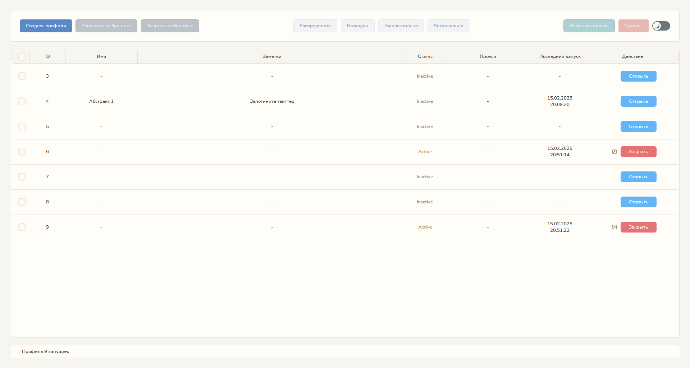
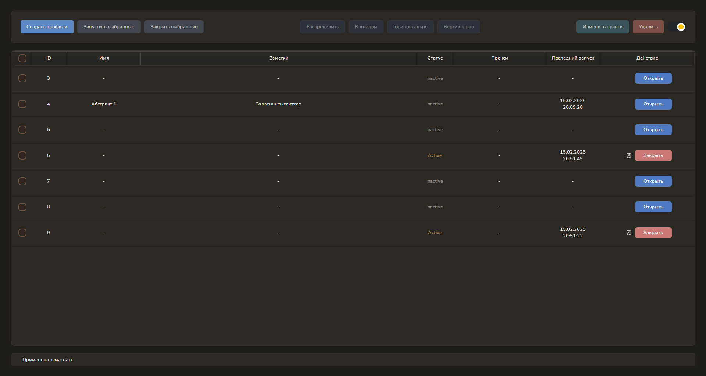

# Veil

Veil – это локальное приложение для создания, управления и запуска анти‑детект браузерных профилей, разработанное для Windows. Veil позволяет генерировать профили с подменой большинства отпечатков, а также имеет удобный пользовательский интерфейс.

---

## Основные возможности

### UI и управление профилями

- **Редактирование профилей:**  
  Для каждого профиля можно редактировать базовое имя, заметки и настройки прокси.  
  Автопарсер автоматически распознаёт и подставляет параметры прокси при вставке.

- **Динамическое управление окнами:**  
  Запущенные профили можно распределять по экрану различными способами:
  - Равномерно (тайлинг)
  - Каскадом
  - Горизонтально
  - Вертикально
- **Поддержка темной и светлой темы:**  
  Пользователь может переключать темы интерфейса для удобства работы в любых условиях.

- **Скриншоты интерфейса:**  
    
  

---

## Анти‑детект

Veil реализует подмену множества браузерных отпечатков через специальное расширение. Среди заменяемых параметров:

- **UserAgent:** Генерация подменённого UserAgent в соответствии с текущей версией Chrome.
- **Язык (Lang) и часовой пояс (Timezone):** Подбираются согласно геоданным IP прокси или заранее заданной конфигурации.
- **Canvas:** Отпечаток Canvas заменяется заранее сгенерированным dataURL.
- **WebGL:** Модификация параметров графического рендера.
- **MediaDevices:** Подмена списка устройств ввода/вывода.
- **RAM и CPU:** Подмена показателей оперативной памяти и количества ядер.
- **ClientRects, AudioContext, WebRTC:** Изменение характеристик API для защиты от fingerprinting.
- **Блокировка порт-сканирования:** Блокируются локальные соединения (localhost, 127.0.0.1).
- **Speech API и WebGPU:** Модификация параметров для маскировки особенностей аппаратного обеспечения.

---

## Как это работает

- **Основа браузера:**  
  Управление и настройка браузера происходит с использованием библиотеки [undetected_chromedriver](https://github.com/ultrafunkamsterdam/undetected-chromedriver), которая написана на базе Selenium и обеспечивает базовую защиту от обнаружения Cloudflare и другими анти-бот системами.

- **Подмена отпечатков:**  
  Основная подмена происходит через браузерное расширение, которое внедряется в профиль. Расширение подменяет данные о Canvas, WebGL, MediaDevices и прочих API.

- **Генерация профиля:**  
  Каждый профиль генерируется с помощью модуля `hardware_profile.py`. В папке каждого профиля (находится в `app/chrome_profiles/`) хранится JSON-файл `hardware_profile.json`, в котором можно просмотреть все сгенерированные данные (например, устройство, настройки браузера, прокси и прочее).

- **Canvas Fingerprint:**  
  Для подмены отпечатка Canvas используется заранее сгенерированный dataURL, который подставляется в расширении.

- **Хранение профилей:**  
  Все данные профилей хранятся локально в каталоге `app/chrome_profiles/`. Программа работает полностью локально, помимо запроса для получения геоданных по IP прокси (для корректного подбора языка и часового пояса).

---

## Недочеты

- Программа не проходила всестороннее тестирование, а отсутствие автообновления требует вашего вмешательства для её улучшения и устранения возможных ошибок.

- В редких случаях при открытии сайта средней кнопкой мыши (колёсиком) подмена отпечатков может не сработать, так как сайт успевает считать оригинальные параметры до их изменения из-за задержки в инициализации расширения. Поэтому рекомендуется открывать сайты напрямую из поисковой строки.

- Программа не подменяет абсолютно все возможные отпечатки, однако охватывает основные и наиболее используемые методы идентификации. В результате достигается покрытие до 90% ключевых отпечатков, что позволяет успешно обходить трекинговые системы на большинстве сайтов и обеспечивает значительно более высокий уровень защиты по сравнению с обычными Chrome фермами.

- Так как для каждого профиля используется ваше основное ядро браузера (пропатченное undetected_chromedriver), подмена UserAgent ограничена одной версией движка, что делает невозможным их полное совпадение. Это связано с тем, что подделка требует поддержки нескольких версий движка, а в данном случае применяется только текущая версия вашего браузера. Единственный способ добиться точного соответствия — патчить различные версии браузера, что здесь не реализовано.

- Небходимость вручную запускать генерацию Canvas DataURL - Перед запуском программы необходимо сгенерировать ссылки, которые будут использоваться программой для подмены Canvas ([см. пункт установки](#установка-и-запуск)).

- Программа может содержать баги, поэтому рекомендуется избегать частого и быстрого нажатия кнопок при обновлении статусов профилей или переключении между активностями, чтобы предотвратить возможные сбои в работе.

## Системные требования

- **ОС:** Windows.
- **Python:** 3.10.
- **UI:** Реализован с использованием PySide6.
- **Дополнительно:** Для работы требуется установленный браузер Chrome (используется undetected‑chromedriver).

---

## Установка и запуск

1. Скачайте проект и перейдите в его корневую папку.

2. Создайте виртуальное окружение.

   ```bash
   python -m venv venv

   venv\Scripts\activate

   pip install -r requirements.txt
   ```

3. Убедитесь что у вас установлен Chrome на устройстве.

4. Откройте [app/extensions/hardware_profiles.py на 292 строке](https://github.com/ENbanned/veil_anti-detect/blob/master/app/extensions/hardware_profiles.py#L292) и замените 132 на номер ващей текущей версии ядра хрома основного Chrome браузера.

5. Сгенерируйте dataURL, которые будут использоваться для подмены Canvas.

   - Откройте командную строку по следущему пути: `app\utils\canvas`.
   - Пропишите **python get.py**.
   - Подождите несколько минут. В результате у вас сгенерируется dataURL для 10000 профилей. При желании можете сгенерировать другое количество, заменив 10000 в файле на другое число.

6. Запустите программу одним из способов:

   - **Способ 1 (вручную через терминал):**

     ```bash
     venv\Scripts\activate

     python main.py
     ```

   - **Способ 2 (автоматически через `main.bat`):**

     Просто запустите `main.bat` (двойным кликом), и программа стартует без лишней консоли и необходимости каждый раз вручную активировать виртуальное окружение.

## Контакт

[@enbanned](https://t.me/enbanned)
